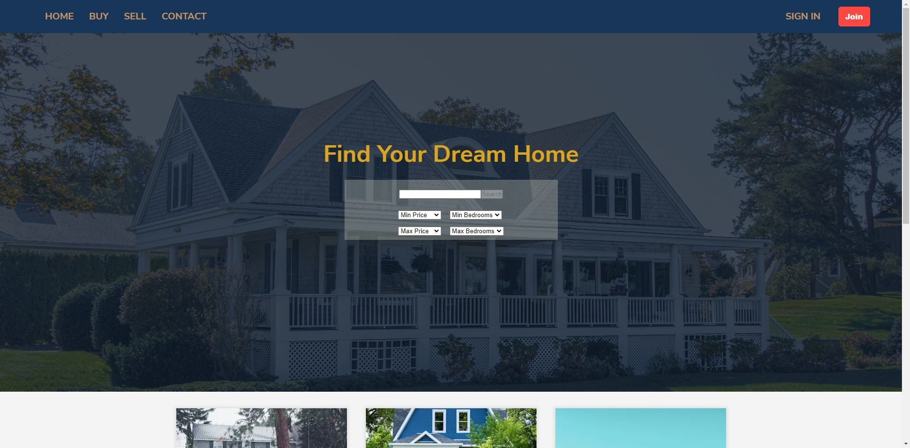
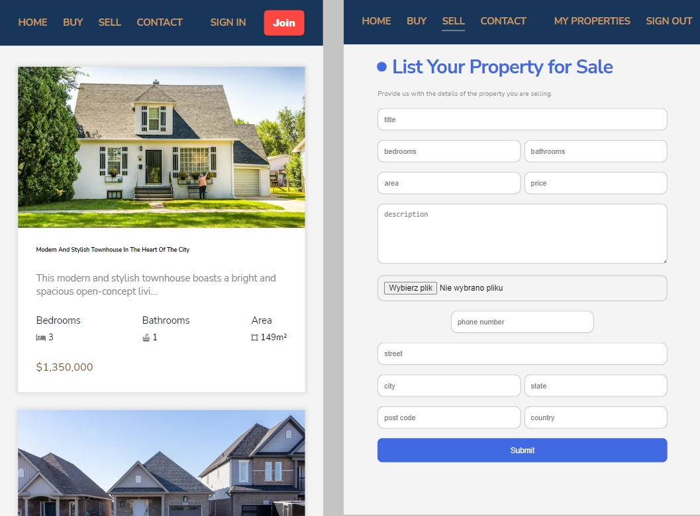

# Real Estate Website

Real Estate Website is a website where you can browse and search for properties, as well as list your own property for sale. In this project, I utilized the following technologies:

## Tool & technologies I've used

- Nextjs
- TypeScript
- Firebase Authentication
- Firebase Firestore
- Firebase Storage

## App functionalities
Real Estate Website includes several functionalities, such as:

Sign up and login using Firebase Authentication
Browse properties by searching and filtering by title, price, and other features
View detailed information about each property, including images, title, description, location, and contact information for the seller
Add new properties for sale by filling out a form, including upload images
Edit and delete properties that you have listed for sale
View a dashboard with all properties that you have listed for sale

## How to use it

```
Use command git clone https://github.com/michalsamulak/real_estate.git

Run npm install to install all the required dependencies.
Create a Firebase project and enable authentication and Firestore.
Create a .env.local file with the following environment variables:

NEXT_PUBLIC_FIREBASE_API_KEY=your_api_key
NEXT_PUBLIC_FIREBASE_AUTH_DOMAIN=your_auth_domain
NEXT_PUBLIC_FIREBASE_DATABASE_URL=your_database_url
NEXT_PUBLIC_FIREBASE_PROJECT_ID=your_project_id
NEXT_PUBLIC_FIREBASE_STORAGE_BUCKET=your_storage_bucker
NEXT_PUBLIC_FIREBASE_MESSAGING_SENDER_ID=your_messaging_sender
NEXT_PUBLIC_FIREBASE_APP_ID=your_app_id

Run npm start to start the development server.
Open http://localhost:3000 in your browser.

```

I hope you enjoy this app

# 
# 
# 
# 